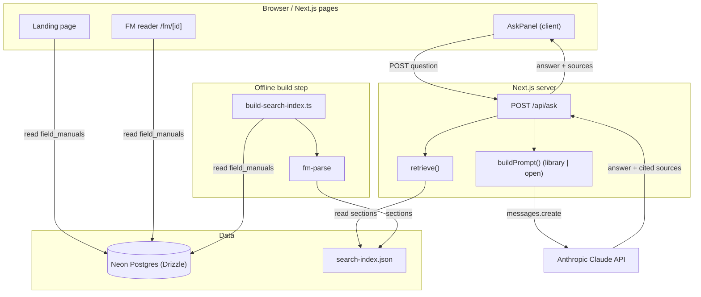

# Army Doctrine Assistant (APD)

A full-text library and AI research assistant for all 51 active U.S. Army Field Manuals. Ask questions in plain English, get answers cited to the exact FM section, and read the source with one click.

## What it does

- **Browse** — searchable index of all 51 active FMs sourced from [armypubs.army.mil](https://armypubs.army.mil)
- **Read** — parsed, section-linked reader with a navigable table of contents
- **Ask** — doctrine assistant powered by Claude. Two modes:
  - _Library only_ — answers strictly from indexed FM excerpts, every claim cited
  - _Model + Library_ — Claude's broader knowledge supplemented by FM excerpts

## Stack

| Layer    | Technology                                    |
| -------- | --------------------------------------------- |
| Frontend | Next.js 15 App Router + Tailwind CSS 4        |
| Database | Neon (Postgres) + Drizzle ORM                 |
| AI       | Anthropic Claude (`claude-haiku-4-5` default) |
| Deploy   | Vercel                                        |

## Architecture

The app has two halves: a request-time web path and an offline indexing step. Next.js Server Components (the landing page and the `/fm/[id]` reader) query the `field_manuals` table in Neon Postgres through Drizzle and render the manuals directly. The browser-side `AskPanel` posts questions to `POST /api/ask`, which runs keyword retrieval over a prebuilt `search-index.json`, assembles a prompt (`library` mode answers strictly from cited excerpts; `open` mode also allows Claude's general knowledge), calls the Anthropic Claude API, and returns the answer plus the cited source sections for deep-linking back into the reader. The index itself is produced offline by `scripts/build-search-index.ts`, which reads `field_manuals` from Postgres, parses each manual with `fm-parse` into sections, and writes the JSON committed under `src/data/`.



## Local setup

### 1. Clone and install

```bash
git clone https://github.com/kevinvwong/APD.git
cd APD
npm install
```

### 2. Configure environment

```bash
cp .env.example .env.local
# Edit .env.local and fill in all four values
```

Required variables (see `.env.example` for format):

| Variable                | Where to get it                                         |
| ----------------------- | ------------------------------------------------------- |
| `ANTHROPIC_API_KEY`     | [console.anthropic.com](https://console.anthropic.com/) |
| `DATABASE_URL`          | Neon dashboard → Connection string (pooled)             |
| `DATABASE_URL_UNPOOLED` | Neon dashboard → Connection string (direct)             |
| `ANTHROPIC_MODEL`       | Optional. Defaults to `claude-haiku-4-5`                |

### 3. Seed the database

```bash
npm run db:seed        # inserts all 51 FMs into Neon
npm run search:index   # builds src/data/search-index.json
```

### 4. Run

```bash
npm run dev
# → http://localhost:3000
```

## Scripts

| Command                | Description                          |
| ---------------------- | ------------------------------------ |
| `npm run dev`          | Start dev server                     |
| `npm run build`        | Production build                     |
| `npm run db:seed`      | Seed field manuals into Neon         |
| `npm run search:index` | Rebuild keyword search index from DB |
| `npm run db:generate`  | Generate Drizzle migration files     |
| `npm run db:migrate`   | Run pending migrations               |

## FM content

All 51 field manuals are U.S. government publications and are in the public domain. Source: [armypubs.army.mil](https://armypubs.army.mil). The markdown versions in this repo were converted from the official PDFs.

## Contributing

See [CONTRIBUTING.md](CONTRIBUTING.md).
