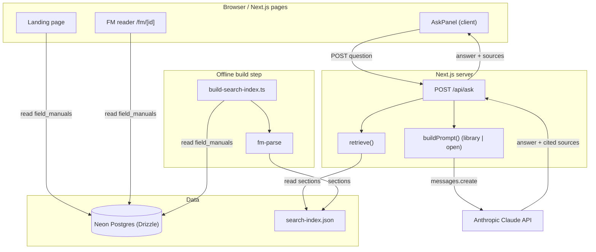

# Army Doctrine Assistant (APD)

A full-text library and AI research assistant for all 51 active U.S. Army Field Manuals. Ask questions in plain English, get answers cited to the exact FM section, and read the source with one click.

## What it does

- **Browse** — searchable index of all 51 active FMs sourced from [armypubs.army.mil](https://armypubs.army.mil)
- **Read** — parsed, section-linked reader with a navigable table of contents
- **Ask** — doctrine assistant powered by Claude. Two modes:
  - _Library only_ — answers strictly from indexed FM excerpts, every claim cited
  - _Model + Library_ — Claude's broader knowledge supplemented by FM excerpts

## Stack

| Layer    | Technology                                    |
| -------- | --------------------------------------------- |
| Frontend | Next.js 15 App Router + Tailwind CSS 4        |
| Database | Neon (Postgres) + Drizzle ORM                 |
| AI       | Anthropic Claude (`claude-haiku-4-5` default) |
| Deploy   | Vercel                                        |

## Architecture

The app has two halves: a request-time web path and an offline indexing step. Next.js Server Components (the landing page and the `/fm/[id]` reader) query the `field_manuals` table in Neon Postgres through Drizzle and render the manuals directly. The browser-side `AskPanel` posts questions to `POST /api/ask`, which runs keyword retrieval over a prebuilt `search-index.json`, assembles a prompt (`library` mode answers strictly from cited excerpts; `open` mode also allows Claude's general knowledge), calls the Anthropic Claude API, and returns the answer plus the cited source sections for deep-linking back into the reader. The index itself is produced offline by `scripts/build-search-index.ts`, which reads `field_manuals` from Postgres, parses each manual with `fm-parse` into sections, and writes the JSON committed under `src/data/`.


```mermaid
flowchart TD
    subgraph Browser["Browser / Next.js pages"]
        Landing["Landing page"]
        Reader["FM reader /fm/[id]"]
        Ask["AskPanel (client)"]
    end

    subgraph Server["Next.js server"]
        API["POST /api/ask"]
        Retrieve["retrieve()"]
        Prompt["buildPrompt() (library | open)"]
    end

    subgraph Data["Data"]
        DB[("Neon Postgres (Drizzle)")]
        Index["search-index.json"]
    end

    Claude["Anthropic Claude API"]

    subgraph Offline["Offline build step"]
        BuildIdx["build-search-index.ts"]
        Parse["fm-parse"]
    end

    Landing -->|read field_manuals| DB
    Reader -->|read field_manuals| DB
    Ask -->|POST question| API
    API --> Retrieve
    Retrieve -->|read sections| Index
    API --> Prompt
    Prompt -->|messages.create| Claude
    Claude -->|answer + cited sources| API
    API -->|answer + sources| Ask

    BuildIdx -->|read field_manuals| DB
    BuildIdx --> Parse
    Parse -->|sections| Index
```

## Local setup

### 1. Clone and install

```bash
git clone https://github.com/kevinvwong/APD.git
cd APD
npm install
```

### 2. Configure environment

```bash
cp .env.example .env.local
# Edit .env.local and fill in all four values
```

Required variables (see `.env.example` for format):

| Variable                | Where to get it                                         |
| ----------------------- | ------------------------------------------------------- |
| `ANTHROPIC_API_KEY`     | [console.anthropic.com](https://console.anthropic.com/) |
| `DATABASE_URL`          | Neon dashboard → Connection string (pooled)             |
| `DATABASE_URL_UNPOOLED` | Neon dashboard → Connection string (direct)             |
| `ANTHROPIC_MODEL`       | Optional. Defaults to `claude-haiku-4-5`                |

### 3. Seed the database

```bash
npm run db:seed        # inserts all 51 FMs into Neon
npm run search:index   # builds src/data/search-index.json
```

### 4. Run

```bash
npm run dev
# → http://localhost:3000
```

## Scripts

| Command                | Description                          |
| ---------------------- | ------------------------------------ |
| `npm run dev`          | Start dev server                     |
| `npm run build`        | Production build                     |
| `npm run db:seed`      | Seed field manuals into Neon         |
| `npm run book:ingest`  | Ingest a Markdown book as a private `book` source (see below) |
| `npm run search:index` | Rebuild keyword search index from DB |
| `npm run db:generate`  | Generate Drizzle migration files     |
| `npm run db:migrate`   | Run pending migrations               |
| `npm run embed:sections` | Populate pgvector embeddings (hybrid retrieval) |
| `npm run eval`         | Score retrieval against the gold set (recall@k / MRR) |

## Retrieval backends

`POST /api/ask` retrieves excerpts via one of three backends, chosen by `RETRIEVE_BACKEND`:

- **`json`** (default) — keyword scoring over the prebuilt `search-index.json`. Zero infra, build-safe.
- **`pg`** — Postgres full-text search (tsvector) over `fm_sections`. Requires the section index in the DB (`npm run index:db`).
- **`hybrid`** — fuses the `pg` keyword path with **pgvector semantic search** via Reciprocal Rank Fusion. Best recall for conceptual queries across the book corpus. Setup:

  ```bash
  npm run db:migrate          # applies 0002_pgvector (extension + embedding column + HNSW index)
  npm run index:db            # populate fm_sections
  npm run embed:sections      # embed each section (needs OPENAI_API_KEY or VOYAGE_API_KEY)
  # then set RETRIEVE_BACKEND=hybrid
  ```

  Embeddings default to OpenAI `text-embedding-3-small` (1536-d); set `EMBED_PROVIDER=voyage` for Voyage AI. The query embeds per request; if embeddings are unavailable it degrades to keyword-only.

## Retrieval evaluation

`npm run eval` runs a gold question set (`eval/retrieval-gold.json`) through the
default JSON retrieval backend and reports **recall@k**, **MRR**, and
**section-recall** — a fast, deterministic, offline signal (no DB/LLM) for
catching regressions and comparing scoring changes. The metric math
(`src/lib/eval-metrics.ts`) is unit-tested. `--min-recall <x>` exits non-zero
below a threshold, so it can gate CI; `--k <n>` sets the window.

## FM content

All 51 field manuals are U.S. government publications and are in the public domain. Source: [armypubs.army.mil](https://armypubs.army.mil). The markdown versions in this repo were converted from the official PDFs.

## Sources beyond FMs (books)

The corpus is modeled as neutral **sources**, not just Field Manuals. Each row in the `sources` table carries a `source_type` (`doctrine` | `book`), an `access` level (`public` | `private`), and — for books — `author` / `citation`. This lets the library hold curated reference works (for example, organization-theory texts that complement the doctrine) alongside the public-domain FMs.

**Copyright:** Field Manuals are public-domain government works; most books are not. The schema defaults book sources to `access = "private"`, and retrieval only surfaces private sources to **signed-in** users. Books are **not** bundled in this repo — supply your own licensed copy.

To add a book:

```bash
# 1. Convert your licensed PDF to Markdown (PyMuPDF; see pdf_to_md.py)
python pdf_to_md.py            # or any tool that yields heading-structured .md

# 2. Ingest it as a private "book" source
npm run book:ingest -- \
  --file ./books/reframing-organizations.md \
  --title "Reframing Organizations" \
  --ref "Bolman & Deal 2021" \
  --author "Lee G. Bolman; Terrence E. Deal" \
  --citation "Bolman, L. G., & Deal, T. E. (2021). Reframing Organizations (7th ed.). Jossey-Bass."

# 3. Rebuild the retrieval index
npm run search:index           # JSON path (default)
# npm run index:db             # OPTIONAL Postgres full-text path
```

The book then appears in the signed-in catalog and is retrievable by the Ask assistant for authenticated users.

## Contributing

See [CONTRIBUTING.md](CONTRIBUTING.md).
